# AWS IoT Demo

A metal-to-alerts example of how to build an IoT enabled monitoring solution using only AWS PaaS offerings. 

# Why

We have been doing this workflow for 5+ years now, much longer if you count fully custom tools. So have countless others. Yet, if you asked a new engineer to build this, you can wave goodbye to a few weeks of their effort as they navigate obtuse documentation and outdated StackOverflow answers. This is our attempt to document what's possible with PaaS tools in 2020. 

## What are we going to build?

To achieve this, we will:

1. Write a Python script that monitors system metrics (CPU, Memory, Temperature, Fan)
   1. You could replace this with actual hardware, perhaps run this script on an Raspberry Pi or even send FreeRTOS metrics from ESP32 but we will save that for another day.
2. Create multiple `things` on AWS IoT Core.  
3. Send these metrics as shadow updates to AWS IoT every 10s (configurable)
4. Configure AWS IoT to route shadow updates to a database
5. Set up a visualisation tool and create dashboards using these updates 
6. Add a few simple alerts on our visualiation tool to send notifications if system metrics cross a threshold

## Git Repo Structure

- `master` = final code + AWS IoT configuration + Grafana dashboard JSON
- `1_python_script` = Python script without AWS IoT integration (print to console)
- `2_aws_iot` = Python script with AWS IoT integration (shadow updates)


## 1 - Python Script For System Metrics

We are going to adapt this excellent [blog post](https://www.pragmaticlinux.com/2020/12/monitor-cpu-and-ram-usage-in-python-with-psutil/) to create our system monitor script.

```
python3 -m venv venv
source venv/bin/activate
echo psutil==5.8.0 > requirements.txt
pip install -r requirements.txt
touch sysmon.py
```

1. Edit `sysmon.py` in your preferred text editor and add in the following functions from the blog post:
   - `get_cpu_usage_pct`
   - `get_cpu_frequency`
   - `get_cpu_temp`
   - `get_ram_usage`
   - `get_ram_total`
2. Next, create a `main` function that calls each of these functions and populates a dictionary: `payload` and prints it.
   1. We will also add a `timestamp` to the payload for use in visualisations later.
3. Add a `while(1)` that calls this `main` function every 10 seconds.
4. Add an argument parser so we can pass the `interval` and a `device_id` as command line arguments.
5. Run the script with `python sysmon.py 10 my_iot_device_1`

You should see output similar to:
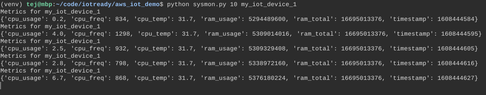


## 2 - AWS IoT Integration

Now, we will add in the ability to send our metrics to AWS IoT. But first, we need to register our devices or `things` as AWS calls them.

### Registering the devices

We will register the devices individually via the AWS Console. However, if you have a large number of devices to register, you may want to script it or use [Bulk Registration](https://docs.aws.amazon.com/iot/latest/developerguide/provision-template.html) via `aws-cli` or the AWS IoT Core Console. 

> We are using `us-east-1` aka N. Virginia for integration later with Amazon Timestream which is not yet available in all regions.

1. Click on `Create a single thing`
   1. Give your thing a name, e.g. `my_iot_device_1`
   2. You can skip `Thing Type` and `Group` for this demo.
   3. Create the thing
2. Use the `One-click certificate creation (recommended)` option to generate the certificates.
   1. Download the generated certificates and the root CA certificate.
   2. Activate the certificates.
3. Attach a policy and register the `Thing`. 
   1. Because we are cavalier and this is a demo, we are using the following `PubSubToAny` policy. 
   2. **DO NOT** use this in production!

```json
{
  "Version": "2012-10-17",
  "Statement": [
    {
      "Effect": "Allow",
      "Action": "iot:*",
      "Resource": "*"
    }
  ]
}
```

Now repeat this a couple more times so we have a few things. I am setting up 3 devices with the imaginative names: `my_iot_device_1`, `my_iot_device_2`, `my_iot_device_3`.

Finally, we will rename our certificates to match our thing names so that it's easier to script together. For instance, I am using the rename utility to bulk rename my certificates:


### Adding the AWS IoT SDK

Because AWS IoT supports MQTT, we could use any MQTT client that supports X.509 certificates. However, to keep things simple, we will use the [official Python SDK](https://github.com/aws/aws-iot-device-sdk-python) from AWS IoT. Specifically, we will adapt the [`basicShadowUpdater.py` sample](https://github.com/aws/aws-iot-device-sdk-python/blob/master/samples/basicShadow/basicShadowUpdater.py).

- Please inspect `aws_shadow_upater.py` for the changes we are making. Primarily, we are wrapping the functionality into 2 functions:
  - `init_device_shadow_handler` that takes AWS IoT specific config parameters and returns a `deviceShadowHandler` specific to our configuration and thing.
  - `update_device_shadow` that takes our system metrics payload and wraps it into a `json` structure that AWS IoT expects for `device shadows`. 
- We will also take this opportunity to modularise our code a bit by moving the `main` function from `sysmon.py` into its own separate file.
- Within `main.py` we are reading our AWS configuration from a combination of environment variables and the local certificates.
  - We only need the following: `export AWS_IOT_HOST=YOUR_AWS_IOT_ENDPOINT.amazonaws.com` and `export CERTS_DIR=certs` assuming you are keeping your certificates in `certs/`. 
  - You will probably want to create a script or `.env` file to set these environment variables
  - For good measure, we are also verifying that the certificates actually exist.
- With this done, we stitch our two modules `sysmon.py` and `aws_shadow_updater.py` together and start publishing updates. If all goes well, you should see the following in your terminal and your AWS Console (go to Thing -> Shadows -> Classic Shadow)

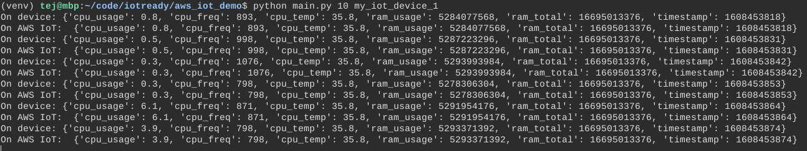

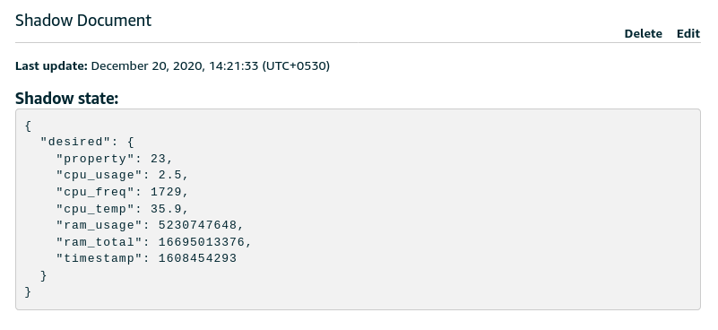

## 3 - Simulating Multiple Devices

> We are done with almost all of the coding needed to get this working. 

This is an easy one, open up multiple terminals/tabs and start a separate process for updating the shadow for each `device`. Something like this:

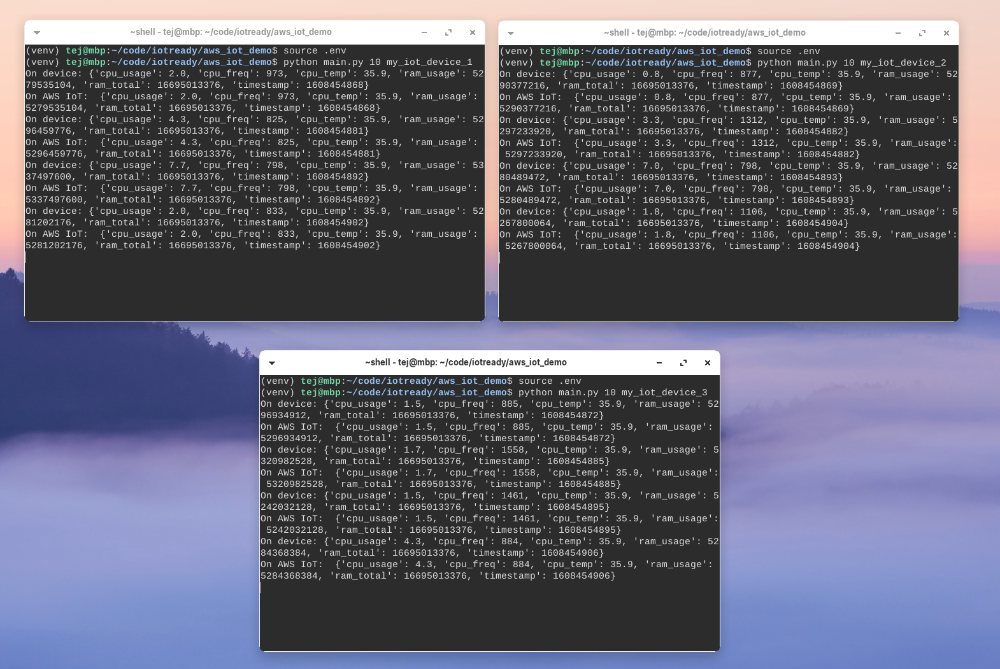

## 4 - Persisting Shadow Updates

In order to visualise, and perhaps analyse, these metrics, we need to persist them in some form of database. Thankfully, AWS IoT has a [Rules Engine](https://docs.aws.amazon.com/iot/latest/developerguide/iot-rules.html) designed for just this purpose. The Rules Engine is essentially a message router with the ability to filter messages using an SQL syntax and send them to various destinations.

Go to `AWS IoT Core -> Act -> Rules` to get started. 

There are 2 steps to enabling rules:
1. Filter: Select the messages we want to act on.
2. Act: Select the action(s) we want to run for each filtered message.

### Filter

AWS IoT uses a reduced [SQL syntax](https://docs.aws.amazon.com/iot/latest/developerguide/iot-sql-reference.html) for filtering messages. Points to note:

- The [shadow topic](https://docs.aws.amazon.com/iot/latest/developerguide/device-shadow-mqtt.html#update-pub-sub-topic) we are interested in is `$aws/things/thingName/shadow/update` where we need to replace `thingName` with the wildcard `+`. Follow [this reference](https://docs.aws.amazon.com/iot/latest/developerguide/topics.html) on topics and wildcards.
- The content of each message contains the entire `state` with `desired` and `reported` properties as well as other metadata. We will need to unpack the `reported` property to get the data we need. Follow [this reference](https://docs.aws.amazon.com/iot/latest/developerguide/iot-sql-select.html) for more details.

Our SQL filter will look essentially like this:

```sql
SELECT 
  state.reported.cpu_usage as cpu_usage,
  state.reported.cpu_freq as cpu_freq,
  state.reported.cpu_temp as cpu_temp,
  state.reported.ram_usage as ram_usage,
  state.reported.ram_total as ram_total
FROM '$aws/things/+/shadow/update'
```

Before we can save this rule, we will also need to add an `action`. Actions define what to do with the filtered messages. This depends on our choice of database. 

### Act

AWS IoT supports a large range of actions out of the box including CloudWatch, DynamoDB, ElasticSearch, Timestream DB and custom HTTP endpoints. See the [full list here](https://docs.aws.amazon.com/iot/latest/developerguide/iot-rule-actions.html).

To confirm that our messages are coming through and we are able to store them, we will use the shiny, new time series database from AWS - Timestream. We will also enable the `CloudWatch` action in case of errors.


#### Timestream DB

As of this writing Timestream is only available in 4 regions. 

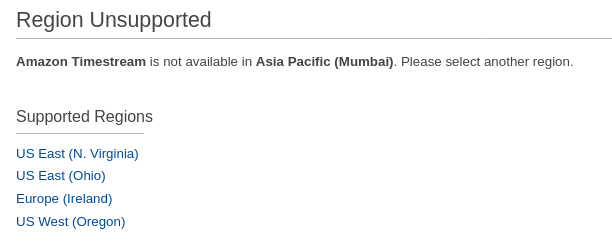

It's **essential** to create the DB in the same region as your AWS IoT endpoint as the Rules Engine does not, yet, support multiple regions for the built-in actions. _You could use a Lambda function to do this for you but that's more management and cost.

We will create a `Standard` (empty) DB with the name `aws_iot_demo`: 

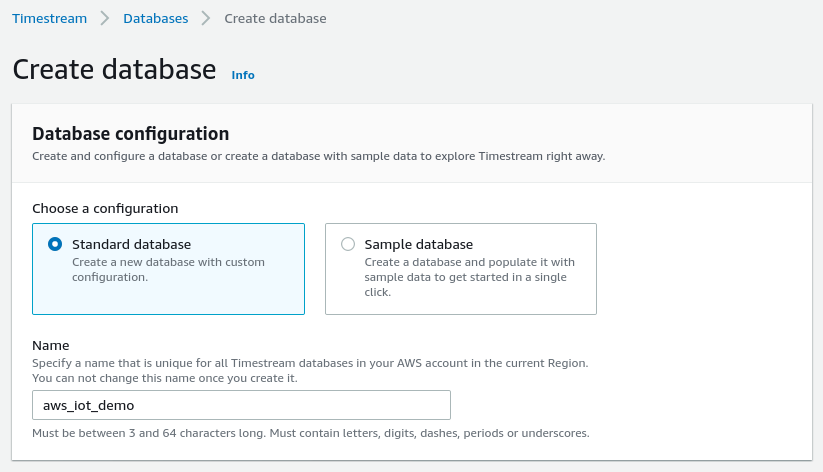

We will also need a `table` to store our data, so let's do that too:

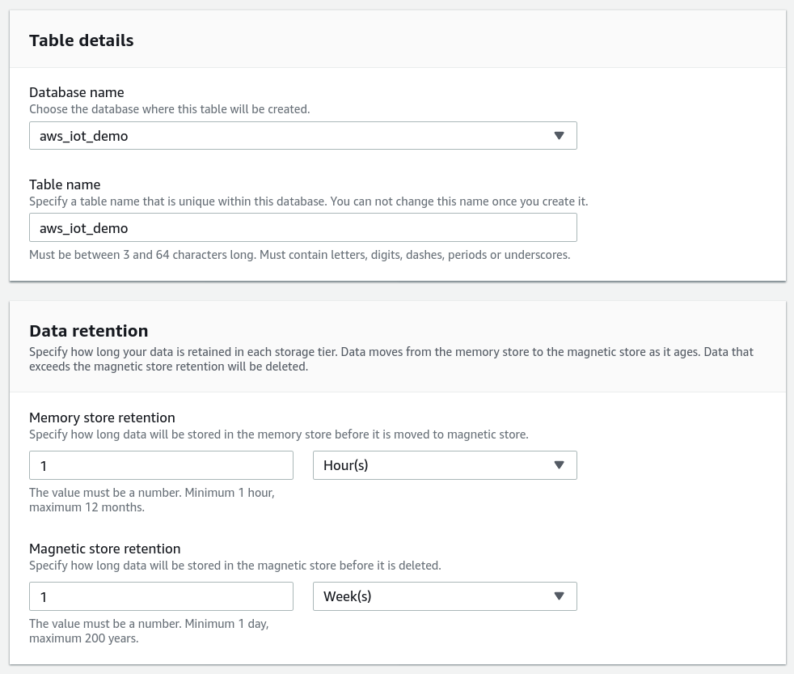

Once this is done, we can return to the rule we started creating earlier and add a new Action.

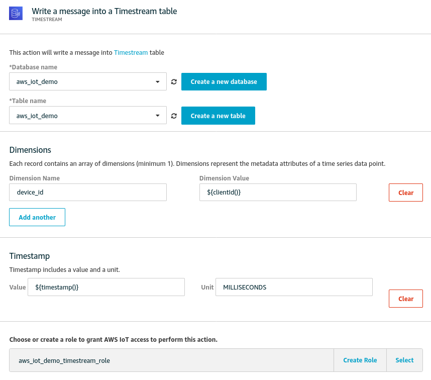

Notes: 
- The AWS IoT Rule Action for Timestream needs at least one [`dimension`](https://docs.aws.amazon.com/iot/latest/developerguide/timestream-rule-action.html) to be specified. Dimensions can be used for grouping and filtering incoming data. 
- I used the following `key`:`value` pair using a substitution template - `device_id`: `${clientId()}`  
- We are sending the device timestamp as part of the shadow update. If we include it as part of the `SELECT` query in the rule, Timestream will assume that `timestamp` is a measurement metric too. 
  - Instead, we will ignore the device `timestamp` and use `${timestamp()}` as the time parameter within the Rule Action. This generates a server timestamp.
- You will also need to create or select an appropriate IAM role that lets AWS IoT to write to Timestream.
- Timestream creates separate rows for each metric so each shadow update creates 5 rows. 

#### CloudWatch
This action is triggered if/when there is an error while processing our rule. Again, follow the guided wizard to create a new `Log Group` and assign permissions.

At the end, your rule should look something like this:

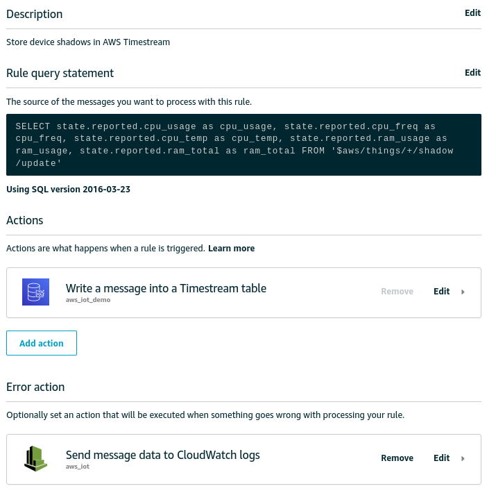

### Query Timestream

Assuming we have started our simulators again, we should start to see data being stored in Timestream. Go over to AWS Console -> Timestream -> Tables ->  `aws_iot_demo` -> Query Table. Type in the following query:

```sql
-- Get the 20 most recently added data points in the past 15 minutes. You can change the time period if you're not continuously ingesting data
SELECT * FROM "aws_iot_demo"."aws_iot_demo" WHERE time between ago(15m) and now() ORDER BY time DESC LIMIT 20
```

You should see output similar to the one below:

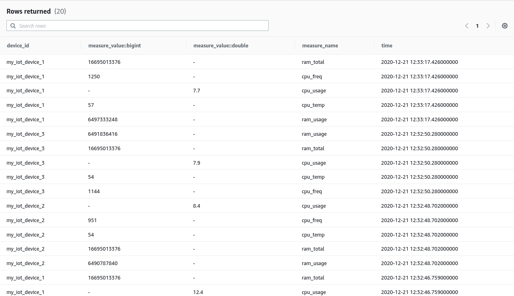

You will notice the separate rows for each metric. We will need a different query in order to combine the metrics into a single view, for instance for use with visualisation or analytics tools.

```sql
SELECT device_id, BIN(time, 1m) AS time_bin,
    AVG(CASE WHEN measure_name = 'cpu_usage' THEN measure_value::double ELSE NULL END) AS avg_cpu_usage,
    AVG(CASE WHEN measure_name = 'cpu_freq' THEN measure_value::bigint ELSE NULL END) AS avg_cpu_freq,
    AVG(CASE WHEN measure_name = 'cpu_temp' THEN measure_value::double ELSE NULL END) AS avg_cpu_temp,
    AVG(CASE WHEN measure_name = 'ram_usage' THEN measure_value::bigint ELSE NULL END) AS avg_ram_usage,
    AVG(CASE WHEN measure_name = 'ram_total' THEN measure_value::bigint ELSE NULL END) AS avg_ram_total
FROM "aws_iot_demo"."aws_iot_demo"
WHERE time between ago(15m) and now()
GROUP BY BIN(time, 1m), device_id
ORDER BY time_bin desc
```

Your output should look something like this - 

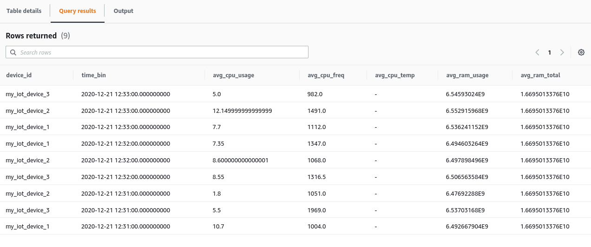


If you do see similar output, you are in business and we can continue to visualisation. If you don't,

- Check the Cloudwatch Logs for errors
- Verify that your SQL syntax is correct - especially the topic
- Ensure your Rule action has the right table and an appropriate IAM Role
- Verify that your Device Shadow is getting updated by going over to AWS IoT -> Things -> my_iot_device_1 -> Shadow
- Looking for errors if any on the terminal where you are running the script.

## Pause For Breath


We have covered a lot of ground. So, let's pause and reflect. Here's what we have done so far:

1. Created a Python script to monitor common system metrics.
2. Hooked up this script to AWS IoT using the SDK and `Thing` certificates.
3. Simulated running multiples of these devices with sending a `Shadow` update.
4. Created a rule to persist these device shadows to `Timestream` and errors to `CloudWatch`.
5. Verified that we are actually getting our data.

Now, we only have the small matter of visualising our data and setting up alerts in case any of our metrics cross critical thresholds. 

With a fresh cup of coffee, onwards...

## 5 - Visualisation

Storage and visualisation are, in fact, two separate operations that need two different software tools. However, these are often so tightly coupled that choice of one often dictates choice of the other. Here's a handy table that illustrates this.

| Storage | Visualisation | Comments  |
| ---     | ---                   | ---       |
| Timestream | AWS QuickSight | See demo below |
| Timestream | Grafana | See demo below |
| DynamoDB | AWS QuickSight | Needs CSV export to S3 first |
| DynamoDB | Redash | Works but with limitations, demo in future post |
| ElasticSearch | Kibana | Works well, demo in future post |
| ElasticSearch | Grafana | Simpler to just use Kibana |
| InfluxDB | InfluxDB UI | Works well, demo in future post |
| InfluxDB | Grafana | Simpler to just use the built-in UI |

There are, of course, numerous other ways to do this. We will focus on the first two in that table.

### Timestream + AWS QuickSight

QuickSight is a managed BI tool from AWS. The [official documentation](https://docs.aws.amazon.com/timestream/latest/developerguide/QuickSight.html) to integrate Timestream with QuickSight is a little dense. However, it's pretty straightforward if you are using `us-east-1` as your region. 

1. Within QuickSight, click on the user icon at the top right and then on `Manage QuickSight`.
2. Here, go to `Security & Permissions` -> `QuickSight access to AWS services` and enable `Timestream` (see image below).
3. Next, within QuickSight, click on `New Dataset` and select `Timestream`. Click on `Validate Connection` to ensure you have given the permissions and confirm.
4. Upon confirmation, select `aws_iot_demo` from the discovered databases and select `aws_iot_demo` from the tables.
5. Click on `Visualise`

So far so good. I had to struggle for a while to understand how to get QuickSight to unpack the metrics from Timestream. Turns out, this is surprisingly easy if you follow this [tutorial video](https://www.youtube.com/watch?v=TzW4HWl-L8s) from AWS. Essentially,

- Create multiple visualisations
- For each visualisation, add a filter on `measure_name`. 
- Click on `time` to add it to the X-axis. Change period to `Aggregrate: Minute`.
- Click on `measure_value::bigint` or `measure_value::double` depending on the metric to add it to the Y-axis. Change to `Aggregate: Average`. 
  - In our case, only `cpu_usage` is a `double`.
- Click on `device_id` to add separate lines for each device. This is added to `Color` in QuickSight.

That's it! My dashboard looks like this - 

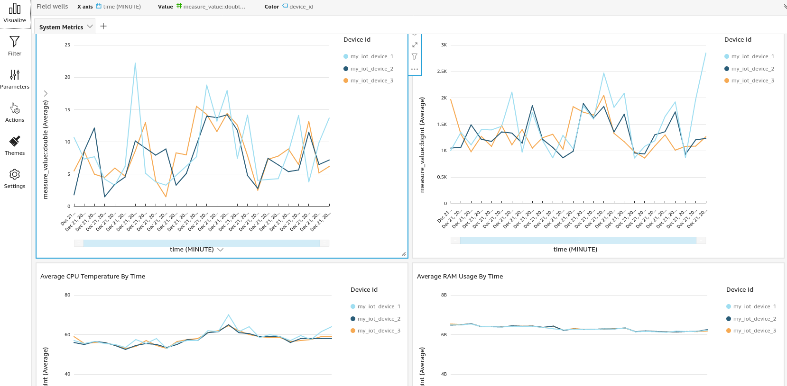

QuickSight is a full-fledged business intelligence (BI) tool with the ability to integrate with multiple data sources. QuickSight also has built-in anomaly detection. This makes it an incredibly powerful tool to use for IoT visualisations and analysis. We could even bring in non-IoT data such as that from an ERP. More on this in a later post!

However, QuickSight:
- Does not support alerts
- Does not support calculations
- Has limited visualisations
- Does not support dashboard embeds, e.g. in a webpage
- Charges [per user](https://aws.amazon.com/quicksight/pricing/?nc=sn&loc=4)

Mind you, the AWS IoT rules engine can be used quite easily for alerts so you *don't* really need alerts in a separate tool. Having said that...

### Timestream + Grafana

[Grafana](https://grafana.com/) has long been a favourite of anyone looking to create beautiful, lightweight dashboards. Grafana integrates with a zillion data sources via input plugins and has numerous visualisations via output plugins. Grafana only does visualisations and alerts but does it really well. There are open source and enterprise editions available.

AWS has an upcoming managed [Grafana service](https://aws.amazon.com/grafana/). Until then, we will use the managed service from [Grafana Cloud](https://grafana.com). You could also spin up Grafana locally or on a VM somewhere with the [docker image](https://grafana.com/docs/grafana/latest/installation/docker/).

There's a [video tutorial](https://www.youtube.com/watch?v=pilkz645cs4) available but you will need to adapt a fair bit to our example. Assuming you have either signed up for Grafana Cloud or installed it locally, you should now:

- Install the [Amazon Timestream plugin](https://grafana.com/grafana/plugins/grafana-timestream-datasource/installation)
- Back in Grafana, add a new `Data Source` and search for `Timestream`. 
- For authentication, we will use Access Key and Secret for a new IAM User.
  - Back in AWS, create a new user with the ~`AmazonTimestreamReadOnlyAccess` policy attached~ `admin` rights. For some reason, Grafana would not connect to Timestream even with the `AmazonTimestreamFullAccess` policy attached.  
- Once the keys are in place, click on `Save & Test`
- Select `aws_iot_demo` in the `$_database` field to set up the default DB. Try as I might, I could not get the dropdown for `$_table` to populate.

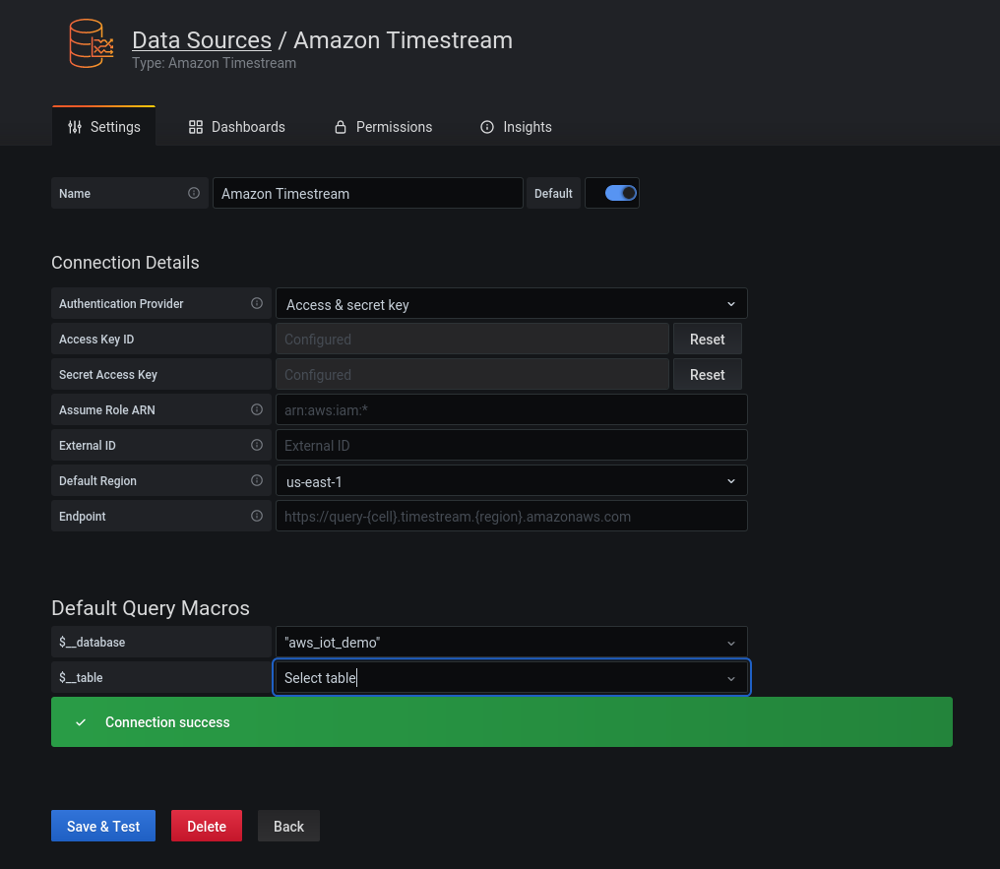

Now, click on `+ -> Dashboard` and `+ Add new panel` to get started.

Unlike QuickSight, Grafana allows you to build queries using **SQL**. So, for our first panel, let's create a CPU Usage chart with the following query:

```sql
SELECT device_id,
    CREATE_TIME_SERIES(time, measure_value::double) as avg_cpu_usage
FROM $__database.$__table
WHERE $__timeFilter
    AND measure_name = '$__measure'
GROUP BY device_id
```

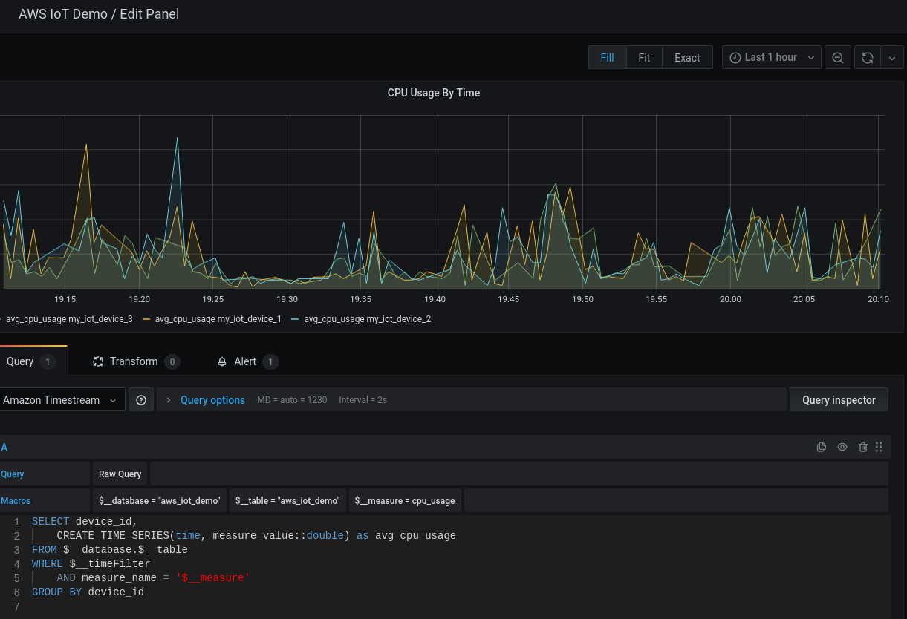

We are essentially doing the same as QuickSight by defining a `where` clause to filter by metric and creating a time series that is grouped by `device_id`. The one, big, difference is the Grafana allows you to add multiple such queries to a single visualisation chart (panel in Grafana speak). Duplicating this panel and making the mods necessary, we end up with a dashboard very similar to that in QuickSight.

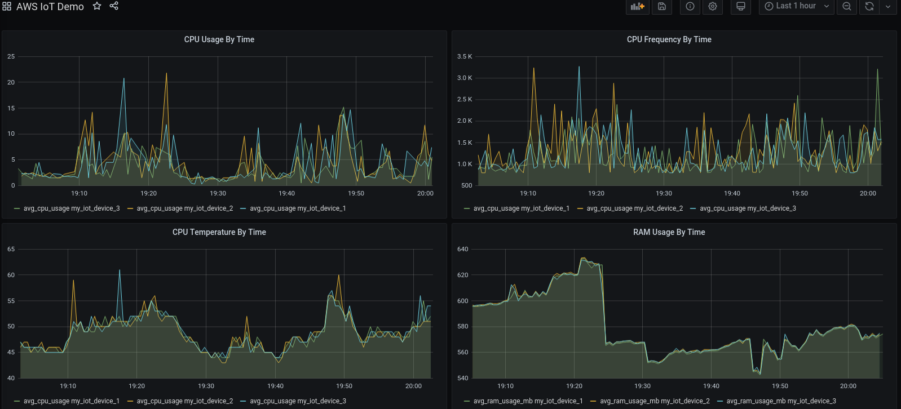

Notice that we get dashboard wide time controls for free!

### Alerts With Grafana

Creating alerts with Grafana is surprisingly easy. Alerts use the same query as the panel and are created in the same UI. 

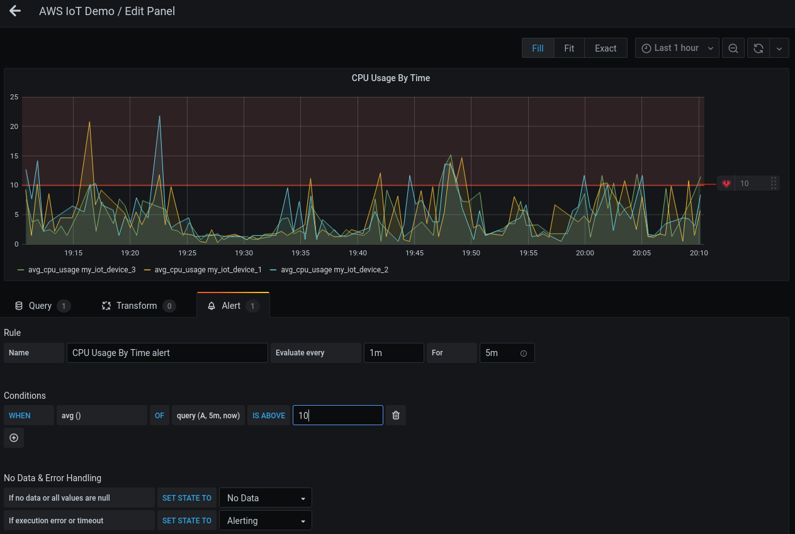

By default, the alert is triggered on the average of the metric but you can change it a different calculation.

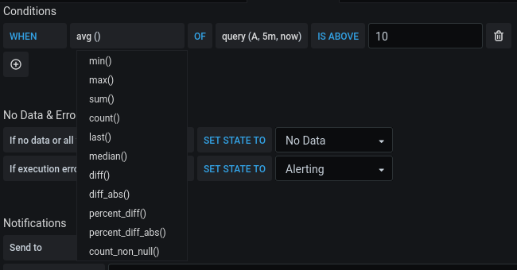

If you have multiple queries on a panel, you can even use a combination of queries!

Alerts can trigger notifications to various `channels` with built-in options for all the major chat apps, email and webhooks. For instance, if you wanted to trigger a notification within a mobile app, you would set up an API somewhere that will be triggered by a webhook configuration within Grafana. Your API is then responsible for notifying the mobile app.

For more on Grafana alerts, check out [the docs](https://grafana.com/docs/grafana/latest/alerting/create-alerts/).

## Conclusions

Once you get around the verbose documentation, and refine your search skills, it's quite straightforward to create an end-to-end flow for most IoT use cases using purely platform-as-a-service offerings. 

We have been running a deployment on AWS for a customer with ~46000 devices for 2+ years now, handling 15-20M messages monthly. All this for a fraction of the cost and attention this would need if we ran the infrastructure ourselves.

That said, I do have a few reservations and will explore those in future posts.

Good luck and reach out to us on [hello@iotready.co](mailto:hello@iotready.co) if you have any questions!

## TODO
- [x] Add LICENSE
- [x] Add screenshots
- [x] Add motivation