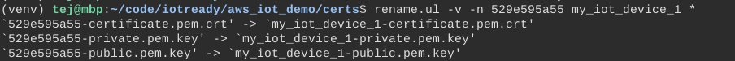
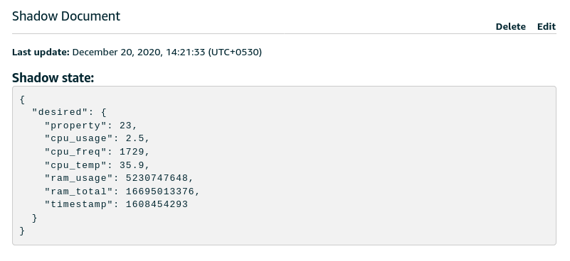
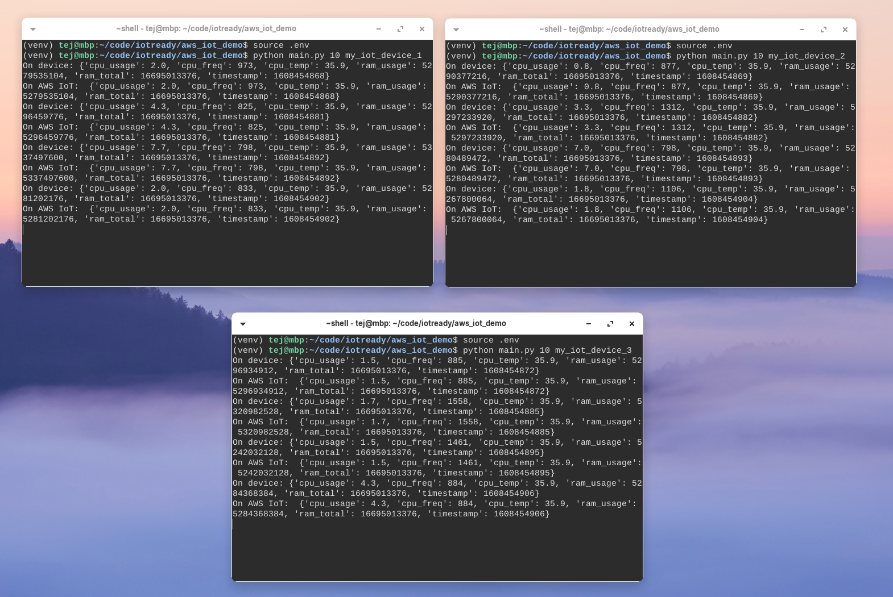
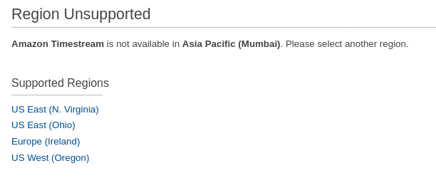
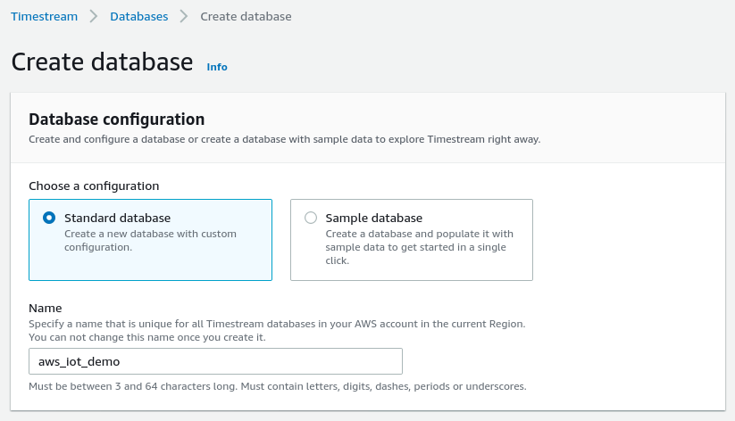
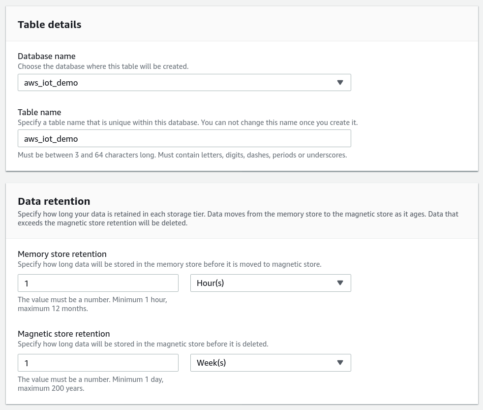
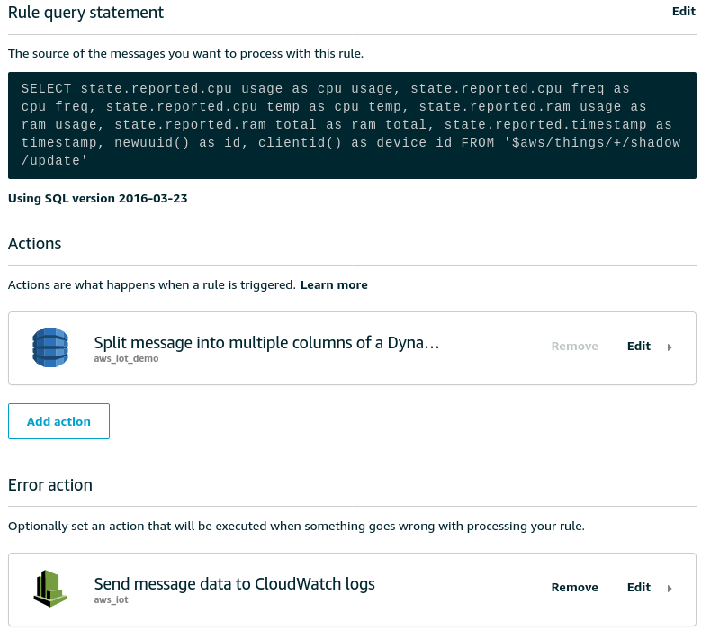
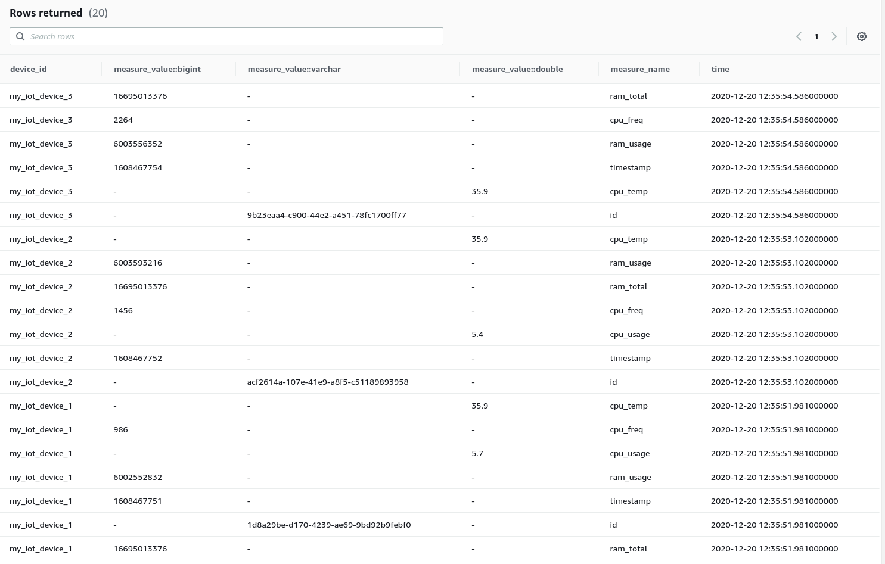

# AWS IoT Demo

## What are we going to build?

A metal-to-alerts example of how to build an IoT enabled monitoring solution using only AWS PaaS offerings. To achieve this, we will:

1. Write a Python script that monitors system metrics (CPU, Memory, Temperature, Fan)
   1. You could replace this with actual hardware, perhaps run this script on an Raspberry Pi or even send FreeRTOS metrics from ESP32 but we will save that for another day.
2. Create multiple `things` on AWS IoT Core.  
3. Send these metrics as shadow updates to AWS IoT every 10s (configurable)
4. Configure AWS IoT to route shadow updates to a database
5. Set up a visualisation tool and create dashboards using these updates 
6. Add a few simple alerts on our visualiation tool to send notifications if system metrics cross a threshold

### Approach #1

PyScript --> AWS_IoT --> AWS_Timestream --> Grafana

### Approach #2

PyScript --> AWS_IoT --> S3 --> QuickSight

### Approach #3

PyScript --> AWS_IoT --> S3 --> Athena --> Redash

## Git Repo Structure

- `master` = final code + AWS IoT configuration + Grafana dashboard JSON
- `1_python_script` = Python script without AWS IoT integration (print to console)
- `2_aws_iot` = Python script with AWS IoT integration (shadow updates)


## 1 - Python Script For System Metrics

We are going to adapt this excellent [blog post](https://www.pragmaticlinux.com/2020/12/monitor-cpu-and-ram-usage-in-python-with-psutil/) to create our system monitor script.

```
python3 -m venv venv
source venv/bin/activate
echo psutil==5.8.0 > requirements.txt
pip install -r requirements.txt
touch sysmon.py
```

1. Edit `sysmon.py` in your preferred text editor and add in the following functions from the blog post:
   - `get_cpu_usage_pct`
   - `get_cpu_frequency`
   - `get_cpu_temp`
   - `get_ram_usage`
   - `get_ram_total`
2. Next, create a `main` function that calls each of these functions and populates a dictionary: `payload` and prints it.
   1. We will also add a `timestamp` to the payload for use in visualisations later.
3. Add a `while(1)` that calls this `main` function every 10 seconds.
4. Add an argument parser so we can pass the `interval` and a `device_id` as command line arguments.
5. Run the script with `python sysmon.py 10 my_iot_device_1`

You should see output similar to:


## 2 - AWS IoT Integration

Now, we will add in the ability to send our metrics to AWS IoT. But first, we need to register our devices or `things` as AWS calls them.

### Registering the devices

We will register the devices individually via the AWS Console. However, if you have a large number of devices to register, you may want to script it or use [Bulk Registration](https://docs.aws.amazon.com/iot/latest/developerguide/provision-template.html) via `aws-cli` or the AWS IoT Core Console. 

> We are using `us-east-1` aka N. Virginia for integration later with AWS Timestream which is not yet available in all regions.

1. Click on `Create a single thing`
   1. Give your thing a name, e.g. `my_iot_device_1`
   2. You can skip `Thing Type` and `Group` for this demo.
   3. Create the thing
2. Use the `One-click certificate creation (recommended)` option to generate the certificates.
   1. Download the generated certificates and the root CA certificate.
   2. Activate the certificates.
3. Attach a policy and register the `Thing`. 
   1. Because we are cavalier and this is a demo, we are using the following `PubSubToAny` policy. 
   2. **DO NOT** use this in production!

```json
{
  "Version": "2012-10-17",
  "Statement": [
    {
      "Effect": "Allow",
      "Action": "iot:*",
      "Resource": "*"
    }
  ]
}
```

Now repeat this a couple more times so we have a few things. I am setting up 3 devices with the imaginative names: `my_iot_device_1`, `my_iot_device_2`, `my_iot_device_3`.

Finally, we will rename our certificates to match our thing names so that it's easier to script together. For instance, I am using the rename utility to bulk rename my certificates:



### Adding the AWS IoT SDK

Because AWS IoT supports MQTT, we could use any MQTT client that supports X.509 certificates. However, to keep things simple, we will use the [official Python SDK](https://github.com/aws/aws-iot-device-sdk-python) from AWS IoT. Specifically, we will adapt the [`basicShadowUpdater.py` sample](https://github.com/aws/aws-iot-device-sdk-python/blob/master/samples/basicShadow/basicShadowUpdater.py).

- Please inspect `aws_shadow_upater.py` for the changes we are making. Primarily, we are wrapping the functionality into 2 functions:
  - `init_device_shadow_handler` that takes AWS IoT specific config parameters and returns a `deviceShadowHandler` specific to our configuration and thing.
  - `update_device_shadow` that takes our system metrics payload and wraps it into a `json` structure that AWS IoT expects for `device shadows`. 
- We will also take this opportunity to modularise our code a bit by moving the `main` function from `sysmon.py` into its own separate file.
- Within `main.py` we are reading our AWS configuration from a combination of environment variables and the local certificates.
  - We only need the following: `export AWS_IOT_HOST=YOUR_AWS_IOT_ENDPOINT.amazonaws.com` and `export CERTS_DIR=certs` assuming you are keeping your certificates in `certs/`. 
  - You will probably want to create a script or `.env` file to set these environment variables
  - For good measure, we are also verifying that the certificates actually exist.
- With this done, we stitch our two modules `sysmon.py` and `aws_shadow_updater.py` together and start publishing updates. If all goes well, you should see the following in your terminal and your AWS Console (go to Thing -> Shadows -> Classic Shadow)




## 3 - Simulating Multiple Devices

> We are done with almost all of the coding needed to get this working. 

This is an easy one, open up multiple terminals/tabs and start a separate process for updating the shadow for each `device`. Something like this:



## 4 - Persisting Shadow Updates

In order to visualise, and perhaps analyse, these metrics, we need to persist them in some form of database. Thankfully, AWS IoT has a [Rules Engine](https://docs.aws.amazon.com/iot/latest/developerguide/iot-rules.html) designed for just this purpose. The Rules Engine is essentially a message router with the ability to filter messages using an SQL syntax and send them to various destiations.

Go to `AWS IoT Core -> Act -> Rules` to get started. Since we are trying to persist device shadows, our SQL filter will look like this:

```sql
SELECT 
  state.reported.cpu_usage as cpu_usage,
  state.reported.cpu_freq as cpu_freq,
  state.reported.cpu_temp as cpu_temp,
  state.reported.ram_usage as ram_usage,
  state.reported.ram_total as ram_total,
  state.reported.timestamp as timestamp,
  newuuid() as id
FROM '$aws/things/+/shadow/update'
```

Before we can save this rule, we will also need to add an `action`. Actions define what to do with the filtered messages. This depends on our choice of database. We will start by using the AWS PaaS offering for time series data, [Timestream DB](https://aws.amazon.com/timestream/).

### Timestream DB

As of this writing Timestream is only available in 4 regions. 



It's **essential** to create the DB in the same region as your AWS IoT endpoint as the Rules Engine does not, yet, support multiple regions for the built-in actions. _You could use a Lambda function to do this for you but that's more management and cost._

We will create a `Standard` (empty) DB with the name `aws_iot_demo`: 



We will also need a `table` to store our data, so let's do that too:



Once this is done, we can return to the rule we were setting up and add the Action.

Notes: 
- The AWS IoT Rule Action for Timestream needs at least one [`dimension`](https://docs.aws.amazon.com/iot/latest/developerguide/timestream-rule-action.html) to be specified. Dimensions can be used for grouping and filtering incoming data. 
- I used the following `key`:`value` pair using a substitution template - `device_id`: `${clientId()}` 
- We are sending the device timestamp as part of the shadow update. I couldn't figure out how to use this as the timestamp in Timestream so I used `${timestamp()}` within the Rule Action. This generates a server timestamp.
- You will also need to create or select an appropriate IAM role that lets AWS IoT to write to Timestream.
- Timestream (like InfluxDB) creates separate rows for each metric so each shadow update creates 7 rows. 

#### Add an error action
To help debug if things don't go wrong (incorrect permissions, invalid data etc), we will add an Error Action that logs to CloudWatch Logs.

Once we are done adding the actions, our rule will look something like this:



### Query Timestream

Assuming we have started our simulators again, we should start to see data being stored in Timestream. Go over to AWS Console -> Timestream -> Tables ->  `aws_iot_demo` -> Query Table. Type in the following query:

```sql
-- Get the 20 most recently added data points in the past 15 minutes. You can change the time period if you're not continuously ingesting data
SELECT * FROM "aws_iot_demo"."aws_iot_demo" WHERE time between ago(15m) and now() ORDER BY time DESC LIMIT 20
```

You should see output similar to the one below:



If you do, you are in business and we can continue to visualisation. If you don't,

- Check the Cloudwatch Logs for errors
- Verify that your SQL syntax is correct - especially the topic
- Ensure your Rule action has the right table and an appropriate IAM Role
- Verify that your Device Shadow is getting updated by going over to AWS IoT -> Things -> my_iot_device_1 -> Shadow
- Looking for errors if any on the terminal where you are running the script.

## TODO
- [x] Add LICENSE
- [x] Add screenshots
- [ ] Add motivation